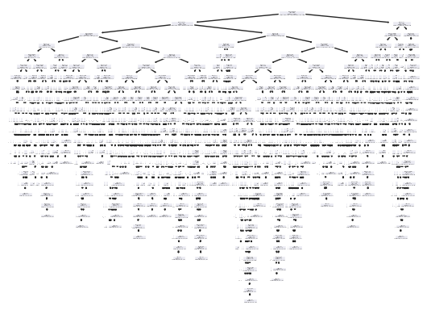

# ost-data-hack

## Vorgehen

### Daten Visualisieren
  #### Erkenntnisse:
  - Anzahl Datenpunkte 20758
  - sauberes Datenset - keine N/A's und kein null values
  - Verteilung über die Obesity Klassen über alle Daten:
  
    
  - Frauen scheinen tendenziell eher die höchsten Gewichte abzudecken, Männer in der Körperhöhe
    
    

  - Es scheint falsch klassifizierte Daten zu geben:
  
    

### 1. Ansatz - erster Schnappschuss "wo stehen wir" / Funktioniert ein Modell
  - Split Train in Train und Validationset

  - Einfacher Decision tree ohne Hyperparameter
     Accuracy ~83%
    
      
  - Confusion Matrix
  
    

## Daten bereinigen
- Aggregierte Spalte "BMI" einführen - histplot bmi/category

    
- Columns mit niedriger Feature importance gedropt
- Findings:
  - Falsch gelabelte Daten (Extremfälle):

      | is               |     predicted       |  BMI  |
      |:-----------------|:-------------------:|------:|
      | Obesity_Type_I   | Insufficient_Weight | 17.10 |
      | Obesity_Type_II  |    Normal_Weight    | 24.39 |
      | Obesity_Type_III | Overweight_Level_I  | 25.91 |

## Feature Selection
- Standardisieren -> Modell Accuracy hat sich verschlechtert

## Model (and Parameter Documentation)
- split Train 80% / Test 20%, random_seed=42
- Decision Tree: Gridsearch max_depth=10, main_samples_leave=1, split=2 Score 86.5
- RandomForrest( Est. 200 ) Score 90.2 (auf Validatierungsset) - Auf Testset 90.1

## Kaggle Competition

## Mögliche weitere Schritte / Erkenntisse
 - Abwägen ob Outliers bereinigen
 - In der Confusion Matrix scheinen sich 2 Cluster abzubilden - Woher kommt das?
 - Selbe Accuracy mit einfacherem oder anderem Modell möglich?