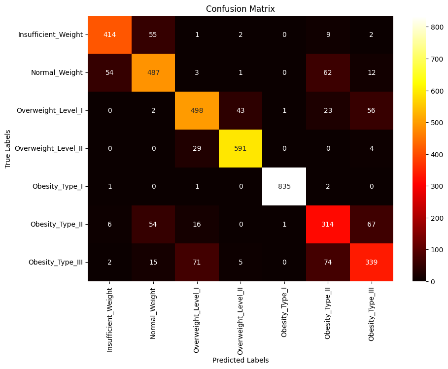

# ost-data-hack

## Vorgehen

- Daten Visualisieren
    - Erkenntnisse:
        - Anzahl Datenpunkte 20758
        - Frauen scheinen tendenziell eher die höchsten Gewichte abzudecken, Männer in der Körperhöhe
        
        - Verteilung über die Obesity Klassen über alle Daten:
        
        - Es scheint falsch klassifizierte Daten zu geben:
        

- 1. Ansatz - erster Schnappschuss "wo stehen wir" / Funktioniert ein Modell
  - Split Train in Train und Validationset

  - Einfacher Decision tree ohne Hyperparameter
     Accuracy ~83%
    
  - Confusion Matrix
    

  
- Aggregierte Spalte "BMI" einführen
  - histplot bmi/category
    

        